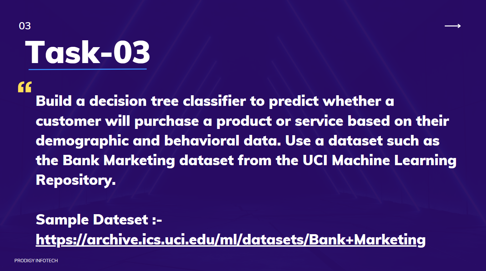

# TASK-3
Build a decision tree classifier to predict whether a customer will purchase a product or service based on their demographic and behavioral data. Use a dataset such as the Bank Marketing dataset from the UCl Machine Learning Repository.

# Prodigy InfoTech Data Science Internship Task 3:
#  
# 

# Welcome to my submission for Task 3 of the Data Science Internship at Prodigy Infotech. In this task, I have built a **Decision Tree Classifier** to predict whether a customer will purchase a product or service based on their demographic and behavioral data. The dataset used for this task is the **Bank Marketing dataset** from the UCL Machine Learning Repository.

# Dataset

# The dataset contains customer information, including features like **age**, **job**, **marital status**, **education**, **balance**, and more. The target variable is whether the customer subscribed to a term deposit (yes or no).

# Tools and Libraries used
# - Jupyter notebook
# - Pandas & Numpy for data manipulation
# - Matplotlib & Seaborn for data visualization
# - Scikit-learn for building the decision tree model

# Methodology

# During this task, I followed these steps:

# 1. **Data Cleaning**:
#    - Handled missing values and outliers.
#    - Transformed categorical features (e.g., job, marital status) using one-hot encoding.

# 2. **Exploratory Data Analysis (EDA)**:
#    - Visualized relationships between features such as **age**, **job**, **balance**, and **education**, and their influence on the target variable.
#    - Used heatmaps and pair plots to understand feature interactions.

# 3. **Modeling with Decision Tree Classifier**:
#    - Split the data into training and testing sets.
#    - Built and trained a decision tree classifier using Scikit-learn’s `DecisionTreeClassifier`.
#    - Tuned hyperparameters such as tree depth and split criteria to improve model performance.

# 4. **Model Evaluation**:
#    - Evaluated the classifier using metrics like accuracy, precision, recall, and F1-score.
#    - Visualized the decision tree structure to understand how it splits data for predictions.

# Conclusion

# This Decision Tree Classifier demonstrated good performance in predicting customer purchases based on their demographic and behavioral data. This model can provide valuable insights for businesses looking to target potential customers more effectively.

# Thank you for reviewing my submission!

# 📬 Contact

# For any inquiries or feedback regarding this project, please contact:

# - <a>[Pramod Doddmane ](https://www.linkedin.com/in/pramoddr)(LinkedIn)</a>
# - Email: pramoddoddmane@gmail.com
